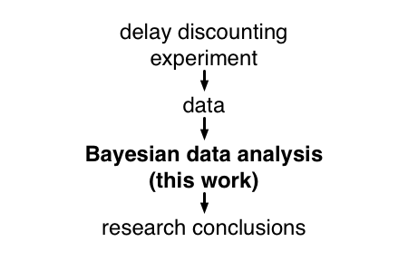

# Bayesian estimation and hypothesis testing for delay discounting tasks

THIS REPOSITORY CONTAINS CODE FOR A PAPER WHICH IS UNDER PEER REVIEW. FOR THE MOMENT IT IS MADE AVAILABLE JUST FOR THE REVIEWERS. PLEASE RESPECT MY INTELLECTUAL PROPERTY - THIS CODE IS UNDER LICENCE. I'LL RELEASE THE CODE PROPERLY IF THE PAPER IS ACCEPTED

**Note: The code here is still in flux.** I will be: adding more extensive user instructions in the Wiki, cleaning and simplifying the code, and adding a few features over time.

# What does this do?

This code conducts Bayesian estimation and hypothesis testing on data obtained from delay discounting (aka inter-temporal choice) experiments. 

# Key features:

* Rather than estimating single values of delay discounting parameters (point estimates), we calculate a posterior distribution of belief over the parameters given the data.
* Hierarchical Bayesian estimation simultaneously estimates trial-level responses, and participant- and group-level parameters. 
* The widely used and easily interpreted 1-parameter hyperbolic discount function is used to not only estimate a participant’s discount rate, but how that varies as a function of reward magnitude (the magnitude effect).
* The psychometric function incorporates measurement errors, that is, participant response errors.

# Go to the [wiki](https://github.com/drbenvincent/delay-discounting-analysis/wiki) for full instructions.

